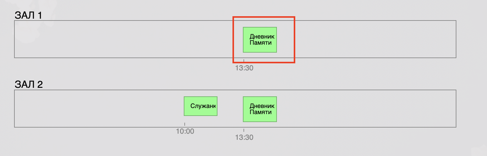

# идемВкино

запуск в режиме разработки: npm run start
запуск в режиме билда: npm run build

логин/пароль для админки: admin/admin

Чтобы добавить сеанс нужно нажать на блок с расписанием зала в разделе "сетка сеансов"

Чтобы удалить сеанс нужно нажать на блок с сеансом который находится в блоке расписания зала

